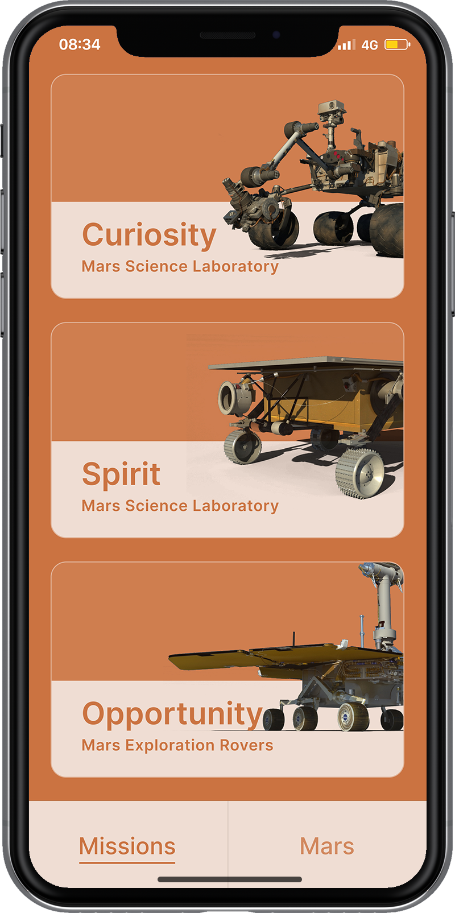

# Discover Mars

**An iOS app that lets you Discover Mars — view images taken by Martian rovers, learn interesting facts about the red planet, and much more.**

[**discovermars.webflow.io**](https://discovermars.webflow.io/) · [**@discovermarsapp**](https://twitter.com/discovermarsapp)

    

<p align="center">
  
</p>

<!-- Optional: drop your iOS 26 simulator screenshot at docs/screenshots/ios26-simulator.png and uncomment:
<p align="center">
  
</p>
-->

## Why Discover Mars?

Discover Mars makes it fun and easy to learn about the red planet and to browse the
latest high-definition imagery sent back by NASA's Martian rovers. Pick a mission —
Curiosity, Perseverance, Opportunity, or Spirit — and explore its story, stats, and
photos, all powered by NASA's open Mars Rover Photos API.

- **Type:** iOS
- **Website:** [discovermars.webflow.io](https://discovermars.webflow.io/)
- **Link:** [twitter.com/discovermarsapp](https://twitter.com/discovermarsapp)

## Features

- **Missions.** Browse the Mars rovers — Curiosity, Perseverance, Opportunity, and
  Spirit — each with a mission overview, launch and landing details, and status.
- **Rover photos.** View high-definition imagery taken by the rovers, fetched live
  from NASA's Mars Rover Photos API, in a full-screen, zoomable photo viewer.
- **Mars facts.** Swipe through bite-sized, interesting facts about the red planet.
- **Settings & What's New.** Share the app, send feedback, follow on Twitter, and
  see what changed in each release.

## Tech Stack

- **Language:** Swift 5
- **UI:** UIKit (storyboard + programmatic), MVC
- **Networking:** `URLSession` against NASA's [Mars Rover Photos API](https://github.com/chrisccerami/mars-photo-api)
- **Dependencies (SPM):** [Mixpanel](https://github.com/mixpanel/mixpanel-swift) (analytics),
  [NYTPhotoViewer](https://github.com/nytimes/NYTPhotoViewer) (photo gallery),
  [PINRemoteImage](https://github.com/pinterest/PINRemoteImage) (image loading & caching)
- **Tooling:** [fastlane](https://fastlane.tools) for TestFlight and App Store releases
- **Minimum iOS:** 13.0

## Getting Started

```bash
git clone https://github.com/Monte9/DiscoverMars-ios.git
cd DiscoverMars-ios
```

### Configuration

The app needs two keys, which are kept out of source control. Provide your own:

```bash
cp DiscoverMars/Secrets.example.xcconfig DiscoverMars/Secrets.xcconfig
```

Then open `DiscoverMars/Secrets.xcconfig` and fill in:

| Key              | Where to get it                                                  |
| ---------------- | --------------------------------------------------------------- |
| `NASA_API_KEY`   | Free key from [api.nasa.gov](https://api.nasa.gov)              |
| `MIXPANEL_TOKEN` | Mixpanel dashboard → Settings → Project Settings → Project Token |

`Secrets.xcconfig` is git-ignored, so your keys never get committed. The values are
injected into `Info.plist` at build time and read at runtime via `AppSecrets`.

Then open the project and run it:

```bash
open DiscoverMars.xcodeproj
```

## Release Management

For release tooling, copy `fastlane/.env.example` to `fastlane/.env` and fill in your
Apple ID, match repo URL, and match passphrase, then:

```bash
bundle install
```

### TestFlight Beta

```bash
bundle exec fastlane ios beta
```

### App Store

Distribution certificates and provisioning profiles are managed with
[fastlane match](https://docs.fastlane.tools/actions/match/):

```bash
bundle exec fastlane match
```

## Credits

- [Monte Thakkar](https://github.com/Monte9) — design & development
- Spencer Everett — design & development

## License

[MIT](LICENSE)
